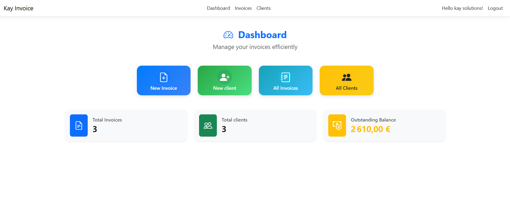
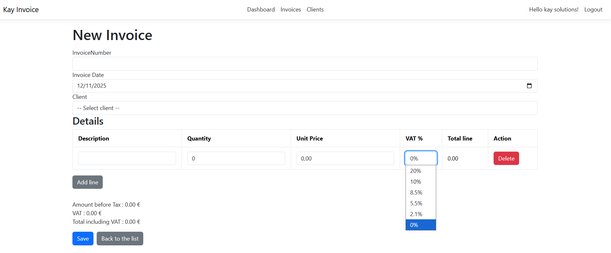
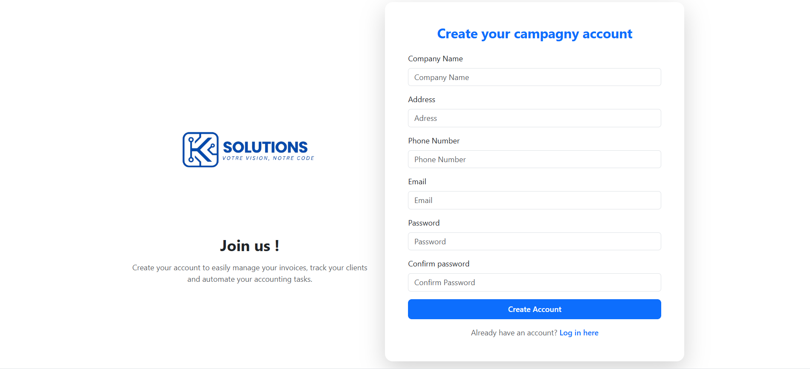
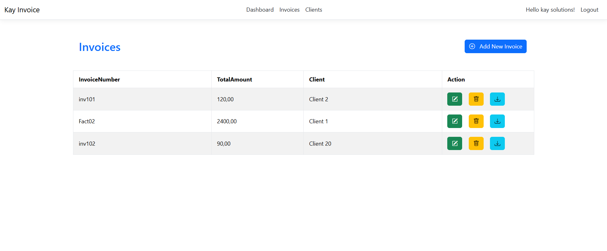
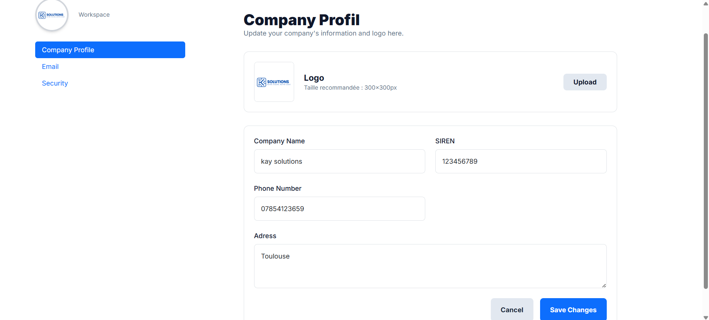

# Kay Invoice
\
*Exemple d'une vue de la page d'acceuil*

Kay Invoice est une application web légère et professionnelle conçue pour simplifier la facturation des auto-entrepreneurs et des artisans. Elle permet de créer, télécharger et partager des factures tout en offrant un système d’authentification sécurisé et une architecture maintenable et testable.

## Description technique

-  But : Fournir une interface simple pour gérer les clients, créer des factures, générer un PDF téléchargeable et partager la facture via un lien ou export.
-  Public cible : auto-entrepreneurs, artisans, petites structures qui ont besoin d’un flux de facturation rapide et sans complexité.
-  Principes suivis : séparation des responsabilités, code testable, sécurité des comptes, facilité de déploiement.
  \

## Fonctionnalités clés

-  Gestion des utilisateurs avec ASP.NET Core Identity pour inscription, login et gestion du compte.
-  Création de factures : saisie des lignes, calcul automatique des totaux et TVA.
-  Export et partage : génération de facture au format téléchargeable (PDF) et possibilité de partage via lien.
-  Sécurité : protection des routes et opérations sensibles, gestion des rôles basiques si nécessaire.
-  Architecture maintenable : pattern Unit of Work, utilisation d’interfaces pour les services et les repositories, inversion de dépendances.

## Architecture et bonnes pratiques
- Framework : ASP.NET Core (version ciblée à préciser dans le projet).
- Persistences : Entity Framework Core avec migration database; pattern Repository + Unit of Work pour centraliser les transactions.
  
- Organisation du code :
Projet API / Web (controllers, viewmodels)
Projet Domain (entités, interfaces)
Projet Infrastructure (EF Core, implémentations des repositories, services d’export)
Projet Identity (configuration Identity, gestion des politiques)
 \
- Services :
        - Service de génération PDF (séparé derrière une interface)
 \
- Sécurité :
        - Utilisation d’ASP.NET Core Identity pour le hashing et la gestion des comptes.
        - Validation côté serveur des entrées utilisateurs.
        - Protection des endpoints avec [Authorize] et vérification des droits sur les ressources.
        - Design pattern : respect du principe SOLID et découplage via interfaces pour faciliter mock et tests.

## Déploiement et configuration

- Prérequis : .NET SDK compatible, base de données (SQL Server / PostgreSQL), outils de migration EF Core.
- Commandes usuelles :
         - Restaurer les packages : dotnet restore
         - Appliquer les migrations : dotnet ef database update
         - Lancer localement : dotnet run
  
-Variables de configuration importantes (exemples à positionner dans appsettings) :
        - ConnectionStrings : chaîne de connexion DB
        - Identity : paramètres de token, politique de mot de passe
    \
